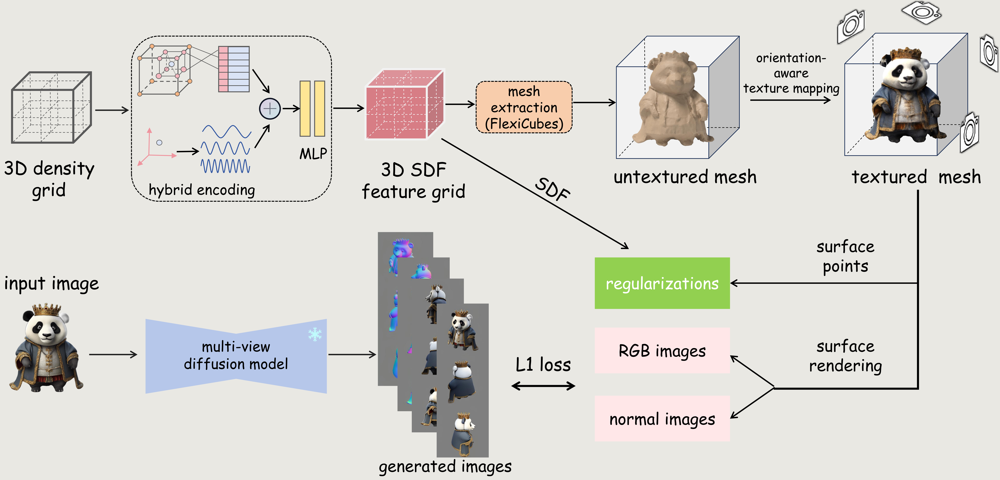

# FlexiDreamer：Single Image-to-3D Generation with FlexiCubes

<p align="center">
     <span style="font-size: 30px;"><a href="https://arxiv.org/abs/2404.00987">Paper</a></span> | <span style="font-size: 30px;"><a href="https://flexidreamer.github.io/">Project Page</a></span>
</p>

<p align="center">
  <a href="https://zhaorw02.github.io/">Ruowen Zhao</a><sup>1,4</sup>, 
    <a href="https://thuwzy.github.io/">Zhengyi Wang</a><sup>2,4</sup>, 
    <a href="https://yikaiw.github.io/">Yikai Wang</a><sup>2</sup>, 
  	Zihan Zhou<sup>3</sup>, 
    <a href="https://ml.cs.tsinghua.edu.cn/~jun/index.shtml">Jun Zhu</a><sup>2,4</sup>
</p>
<p align="center"><sup>1</sup>University of Chinese Academy of Sciences,&ensp;<sup>2</sup>Tsinghua University,&ensp;<sup>3</sup>Xidian University,&ensp; <sup>4</sup>ShengShu&ensp;
<p align="center"> <b>Our Code will be released soon...</b> 🏗️🚧🔨</p>

## Abstract

3D content generation has wide applications in various fields. One of its dominant paradigms is by sparse-view reconstruction using multi-view images generated by diffusion models. However, since directly reconstructing triangle meshes from multi-view images is challenging, most methodologies opt to an implicit representation (such as NeRF) during the sparse-view reconstruction and acquire the target mesh by a post-processing extraction. However, the implicit representation takes extensive time to train and the post-extraction also leads to undesirable visual artifacts. In this paper, we propose FlexiDreamer, a novel framework that directly reconstructs high-quality meshes from multi-view generated images. We utilize an advanced gradient-based mesh optimization, namely FlexiCubes, for multi-view mesh reconstruction, which enables us to generate 3D meshes in an end-to-end manner. To address the reconstruction artifacts owing to the inconsistencies from generated images, we design a hybrid positional encoding scheme to improve the reconstruction geometry and an orientation-aware texture mapping to mitigate surface ghosting. To further enhance the results, we respectively incorporate eikonal and smooth regularizations to reduce geometric holes and surface noise. Our approach can generate high-fidelity 3D meshes in the single image-to-3D downstream task with approximately 1 minute, significantly outperforming previous methods.


## Method

The inference image is fed into multi-view diffusion model to generate multi-view images. Then an end-to-end reconstruction framework based FlexiCubes is trained end-to-end for a high-quality mesh. The mesh extracted from signed distance function can be iteratively optimized by minimizing the difference between its rendering images and multi-view generated images.



## Comparisons


## Citation

If you find FlexiDreamer is helpful, please cite our report:

```bibtex
@article{zhao2024flexidreamer,
    title={FlexiDreamer: Single Image-to-3D Generation with FlexiCubes},
    author={Zhao, Ruowen and Wang, Zhengyi and Wang, Yikai and Zhou, Zihan and Zhu, Jun},
    journal={arXiv preprint arXiv:2404.00987},
    year={2024}
  }
```

